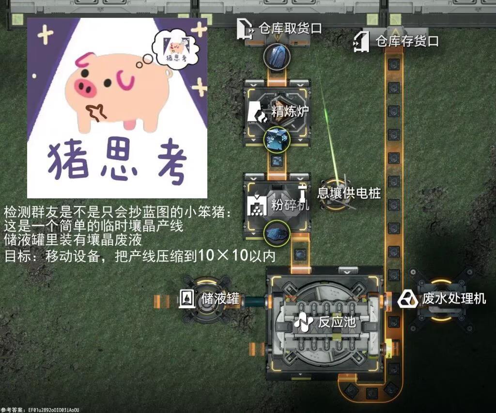
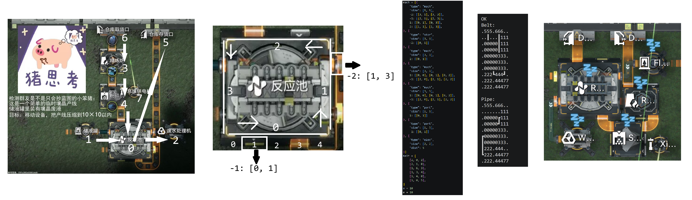

# Endfield SC AIC solver

Endfield small-scale Factory (Automated Industry Complex) solver

终末地小型工厂摆放求解器

灵感来源于一个群友的问题，于是尝试写了个搜索，发现泰拉了。尝试将这个问题形式化成了整数规划问题然后上 OR-Tools 的 CP-SAT 求解。

代码中判断了机器放置，管道连接和电力系统的覆盖等逻辑。对于一组给定的机器和传送带（管道）连接能输出一组可行解或报告不可能。

原问题（10×10）确实是解决了，但是对于稍微大点规模的问题还是有点拉（15×15 左右的问题需要数分钟解决，具体时间取决于参数和电脑配置），之后应该能有更好的求解方法。（挑战 NPC 这块）

结论是现在来看还不是特别实用，但是提供了一种思路。

Further instructions and detailed settings can be seen at the beginning of `main.py`.

关于使用的说明参见 `main.py` 开头的英文注释。机器口子的标号方法比较丑，现在可以凑合着用。

代码和注释绝大部分使用手搓，小部分使用 copilot，如果有误请在 issue 指出或发 pr。

运行方法 `pip install -r requirements.txt` 然后 `python main.py`。

### 可视化编辑器（推荐）

为了避免手工填写 `mach` / `belt` 等数据结构，仓库中提供了一个**纯前端单文件**可视化编辑器 `editor.html`，直接用浏览器打开即可使用（无需任何后端 / 依赖）。

#### 界面布局

- **左侧调色板**：列出终末地常用设施的预设（扩容反应池、反应池、天有烘炉、赤铜精炼炉、粉碎机、仓储存取箱、暗管出口、存取口、电线桩、分汇流器等）。点一下即在主画布求解区域中心附近的空位放下一个机器，**自动按预设填好端口**（作为"空闲端口"声明）。预设数据集中存放在 `presets.js`，可按需自行扩展；
- **主画布**：以虚线框标出 `n × m` 求解区域；机器可拖到任意位置（含求解区外的暂存区）；电桩附近以淡黄虚线显示供电半径覆盖；
- **顶部画布工具栏**：
    - **平移工具 (V)**：按住机器拖动 / 按住空白处拖动平移整张画布（也可用中键拖动）；点机器选中、按方向键微调一格；按 `Delete` 删除；
    - **传送带工具 (B)** / **管道工具 (P)**：点中第一个机器边缘的端口圆点开始连接，再点另一个机器的端口完成；端口的出 / 入方向由 belt 自动确定，无需手工选；右键端口可断开已有连接；
    - **回到中心**、**旋转 (h↔w 互换)**、**删除选中** 等辅助按钮；
- **右侧详情面板**：选中机器后可改类型 / 尺寸 / 电桩半径 / 备注（备注会实时显示在画布机器上）；列出该机器关联的所有连接，可单条删除；
- **右下代码预览**：实时生成与 `main.py` 兼容的 Python 代码片段，「复制」一键放入剪贴板，或「下载 .py」；
- **顶部全局工具栏**：设置 `n` / `m` / 缩放滑动条；支持鼠标滚轮以光标位置为中心缩放；可导出 / 导入 JSON 备份方案、加载内置示例（即 `tests.py` 中的 test 1）。

数据自动保存到浏览器 `localStorage`，刷新不丢失。

#### 端口与连接

端口编号规则与 `main.py` 一致：边 `0 / 1 / 2 / 3 = 下 / 右 / 上 / 左`，距离 `pos` 从 DL / DR / UR / UL 角**逆时针**起算。编辑器自动按规则布置每个端口的可点圆点位置，无需手工换算。

端口在编辑器中分两种状态：

- **已连接端口**：通过传送带 / 管道工具建立连接后产生，由 belt 管理。其出 / 入方向由所属 belt 自动决定（`frmPort` 即出口、`toPort` 即入口）。圆点显示为实心三角，颜色与连接类型一致；
- **空闲端口（声明但未连）**：物理上设备就有这个口子，但当前问题里没用到。**在平移工具下**点击机器（选中后）边缘的端口圆点会循环切换该位置的空闲声明：`无 → 管道出(-2) → 传送带出(-1) → 传送带入(+1) → 管道入(+2) → 无`。空闲端口圆点显示为**虚线圆环**，会在生成 Python 代码时一同写入对应机器的 `mach[i][kind]` 列表，作为求解器的额外候选位置。这对应原文档中"将它所有的口子（注意不只是已经连好的口子）写进去"的要求。

**右键端口**可一键删除占用它的连接或空闲声明。

连接线在画布上显示：
- 传送带 = 黄色实线，管道 = 蓝色虚线；
- **正交布线**：从端口先沿其法向（上 / 下侧端口必先竖直走，左 / 右侧端口必先水平走）伸出一段，再 L 型转折到目标端口；
- 选中某机器时，与其相关的连接高亮，其它连接淡化。

#### 关于机器朝向

求解器内部已自动处理机器旋转（变量 `r`）与镜像（变量 `p`），所以**编辑器画布中机器的摆放只需要对应"未旋转"形态**——即输入数据应描述设施的原始朝向，旋转交给求解器决定。

### 可视化求解结果

求解成功后，`main.py` 会在仓库目录生成一份 `solution.json`，包含每个机器的最终位置、旋转角度、是否镜像、占用格子、所有端口的实际坐标和朝向，以及每条传送带 / 管道走过的所有边。在编辑器顶栏点击绿色的 **「加载求解结果」** 选中这个 JSON 文件即可：

- 画布切换到**结果展示模式**：顶部出现绿色提示条 + 端口颜色图例；
- 机器按求解后的位置和占用大小渲染，标题显示 `旋转角度·镜像` 标记；
- 传送带（黄色实线）/ 管道（蓝色虚线）沿求解器决定的**实际路径**逐边绘制；
- 每个端口在其求解后的格子上画**彩色三角形**：颜色区分出 / 入与类型——
    - 🔴 红色：`-2` 管道出口
    - 🟠 橙色：`-1` 传送带出口
    - 🟢 绿色：`+1` 传送带入口
    - 🔵 蓝色：`+2` 管道入口
- 三角形的**朝向**为端口求解后的实际朝向：出口指向机器外侧，入口指向机器内侧；
- 结果模式下编辑相关按钮（添加机器、连接工具、旋转 / 删除）会变灰禁用，避免误操作；
- 点 **「清除结果」** 按钮即可回到编辑模式继续修改输入再次求解。

如果是在远程服务器（如 Linux / HPC）上跑 `main.py`，把生成的 `solution.json` 拉回本地（`scp` / `rsync` 等），用本地浏览器打开 `editor.html` 加载即可。

### Usage

1. 将代求的产线中的设施（包括仓库存取口，电桩以及分流/汇流器）从零开始标号；
2. 对于每座设施：
    - 其类型（`"type"`）为：`mach` 需要供电的设施；`stor` 除后三种外，不需要供电的设施；`port` 仓库存取口，只能放在上边缘；`elec` 电桩；`logi` （管道）分流/汇流器。注意电桩 `elec` 的 `dist` 参数表示覆盖半径，默认设为 5 即可；
    - 其大小（`"size"`）填入 [长，宽]（长为图中的 1/3 方向长度，宽为图中的 2/4 方向长度）；
    - 将它所有的口子（注意不只是已经连好的口子）写成二元组的形式，第一个整数表示口子所在的边（0/1/2/3 表示下右上左），第二个整数表示从逆时针方向数在当前边上的位置；
    - 口子的类型：-2 表示管道出口，-1 表示传送带出口，1 表示传送带入口，2 表示管道出口；
    - 参考图和示例代码，将机器信息按编号依次填入 `mach`。
3. 在 `belt` 中填入资源输送信息，形如三元组，第一个数 1/2 表示传送带/管道，后两个数表示起点设施编号和终点设施编号。
4. 输入 n 和 m 表示放置的区域纵向/横向格数限制。确认 `main.py` 中的环境参数。`_worker_num` 的大小取决于 CPU 核数，取略小于核数的值时效果最佳。
5. 运行程序。根据问题的复杂程度可能花费几秒至几分钟不等。
6. 在输出中获取结果。若结果为 `OK` 则可得一组解。若结果为 `NO` 则说明无解。若结果为 `TL` 说明在时间限制内不能判断是否有解。获得其他结果请开 issue。

### To-Do

- 优化变量和限制，或者干脆换个写法；
- 将所有机器的口子编号；
- 部分机器的管道的特定出口是对应特定产物的（如提纯机），这部分逻辑还没加进去；
- 目前的仓库存取口限制为只能放在上边缘;
- 机器摆放的时候旋转等细节被忽略了，希望在输入和输出端都有 GUI 界面。

### Credit

- Google OR-Tools
- 提出问题的群友 kokobird
- 原题目作者
